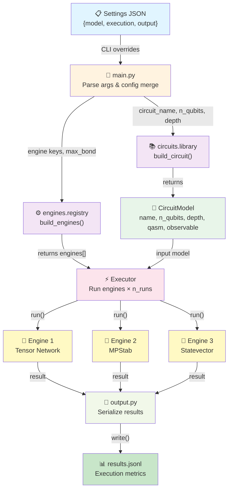

# mssim — Multi System Simulator

A quantum circuit classical simulation package supporting multiple simulation engines. Designed for high-performance benchmarking and comparative analysis of different quantum simulation backends.

## Installation

```bash
pip install -e .
```

## Quick Start

```python
from mssim import build_circuit, build_engines, Executor

# Create a circuit model
model = build_circuit("random_rx", n_qubits=6, depth=4)

# Set up simulation engines
engines = build_engines(["tn", "sv"], max_bond_dimension=32)

# Run simulations and collect results
executor = Executor(n_runs=10, output_file="results.jsonl", output_fmt="jsonl")
batch_results = executor.run(model, engines)

# View results
for br in batch_results:
    print(br.summary())
```

## Project Structure

```
mssim/
├── main.py                          # Entry point: config parsing and orchestration
├── src/mssim/
│   ├── __init__.py
│   ├── executor.py                  # Executor: orchestrates engine runs
│   ├── output.py                    # Result row serialization (JSONL/HDF5)
│   ├── circuits/
│   │   ├── __init__.py
│   │   ├── model.py                 # CircuitModel dataclass
│   │   └── library.py               # Circuit builders (Ising, QAOA, Random, etc.)
│   └── engines/
│       ├── __init__.py
│       ├── abstract.py              # BenchmarkEngine base class
│       ├── converters.py            # QASM format converters
│       ├── mpstab_engine.py         # MPStab / HSMPO backend
│       ├── quimb_engine.py          # Quimb tensor network backend
│       ├── statevector_engine.py    # Qiskit statevector backend
│       └── registry.py              # Engine factory & registry
├── script/
│   ├── run_simple.sh                # Single-machine launcher
│   └── run_parallel.sh              # SLURM array job launcher
├── tests/
│   └── test_basic.py
├── results/                         # Output directory
├── settings.json                    # Configuration file
├── pyproject.toml                   # Package metadata
└── README.md
```

## System Architecture



## Supported Engines

| Engine | Backend | Use Case |
|--------|---------|----------|
| `"tn"` | Quimb | Tensor network, large systems |
| `"mpstab"` | MPStab | MPS with stabilizer optimization |
| `"sv"` | Qiskit | Exact statevector simulation |

## Usage

### Command Line

```bash
# Install in editable mode
pip install -e .

# Run locally with example settings
python main.py --settings settings.json \
               --n_qubits 8 --depth 4 --engine tn \
               --n_runs 20 --max_bond 32

# Override specific settings
python main.py --settings settings.json \
               --engine tn,sv \
               --output results/custom_output.jsonl
```

### Settings JSON Format

```json
{
  "model": {
    "circuit": "random_clifford",
    "n_qubits": 8,
    "depth": 4,
    "observable": ["Z", "Z", "I", "I", "Z", "Z", "I", "I"],
    "kwargs": {}
  },
  "execution": {
    "engines": ["tn", "sv"],
    "n_runs": 10,
    "max_bond_dimension": 32
  },
  "output": {
    "filename": "results/output.jsonl",
    "format": "jsonl"
  }
}
```

### Configuration Options

| Field | Type | Description | Example |
|-------|------|-------------|---------|
| `model.circuit` | str | Circuit family name | `"random_clifford"` |
| `model.n_qubits` | int | Number of qubits | `8` |
| `model.depth` | int | Circuit depth | `4` |
| `model.observable` | list[str] | Measurement observable | `["Z", "I", "Z"]` |
| `model.kwargs` | dict | Circuit-specific parameters | `{}` |
| `execution.engines` | list[str] | Engines to run | `["tn", "sv"]` |
| `execution.n_runs` | int | Repetitions per engine | `10` |
| `execution.max_bond_dimension` | int\|null | MPS bond cap | `32` |
| `output.filename` | str | Output file path | `"results/output.jsonl"` |
| `output.format` | str | Output format | `"jsonl"` or `"hdf5"` |

## Core Components

### CircuitModel (`circuits/model.py`)
Self-contained quantum circuit specification:
- **qasm**: OpenQASM 2.0 string with parametrized gates
- **observable**: Pauli measurement operator
- **parameter_sampler**: Callable generating fresh random parameters
- **metadata**: Circuit-specific configuration

### Executor (`executor.py`)
Orchestrates simulation runs:
- Runs each engine multiple times (`n_runs`)
- Collects timing and result statistics
- Handles errors gracefully with `skip_on_error` mode
- Outputs results in JSONL or HDF5 format

### Output (`output.py`)
Result row serialization:
- Atomic writes prevent corruption
- Stores execution metrics (time, fidelity, observables)
- Supports JSONL and HDF5 backends

## SLURM Integration

```bash
# Submit array job
sbatch script/run_parallel.sh config/settings.json 8 4

# Job runs with parameters varied across array tasks
```

The launcher automatically embeds SLURM metadata (job ID, array task ID, hostname) in result files for traceability.
